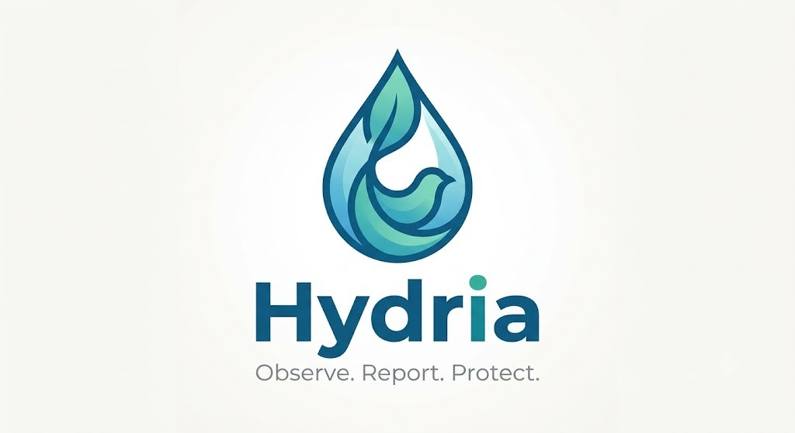

<p align="center">
  
</p>

<h1 align="center">Hydria</h1>

<p align="center">
  <strong>Observe.Report.Protect</strong><br>
  <em>Citizen Science Freshwater Monitoring and Ecological Intelligence Platform</em>
</p>

<p align="center">
  
  
  
  
  
</p>

---

## Overview

Freshwater ecosystems in urban and peri-urban areas face increasing ecological pressure from industrial discharge, untreated sewage, solid waste accumulation, and invasive algal blooms. While citizens frequently observe these environmental changes firsthand, traditional reporting systems are often inaccessible, slow, and overly bureaucratic.

Hydria is a modern citizen science platform designed to transform qualitative, on-the-ground human observations into structured, verified environmental intelligence. By pairing simple sensory observations with automated image validation, geographic resolution, and Google Gemini AI, Hydria enables anyone to document water quality in under 60 seconds and receive instant, science-backed ecological assessments.

---

## How Hydria Is Different from Other Solutions

Most environmental reporting tools fall into one of two extremes: complex institutional databases inaccessible to ordinary citizens, or generic complaint ticketing systems that lack environmental intelligence. Hydria was built from the ground up to solve these fundamental limitations.

| Feature / Capability | Traditional Government Portals | Generic Civic Complaint Apps | Hydria Citizen Platform |
| :--- | :--- | :--- | :--- |
| **Observation Language** | Requires technical lab parameters (BOD, COD, pH, turbidity meters) | Freeform text description without environmental structure | Standardized sensory metrics (water color, odor, waste level, algae, wildlife impact) |
| **Location Entry** | Complex manual GPS coordinates or tedious administrative drop-downs | Device GPS only, often failing indoors or without signal | Natural water body search (e.g., "Bellandur Lake, Bengaluru") with automatic geocoding and optional GPS |
| **Photo Verification** | None; unverified file attachment | Basic upload without content checking | Multi-stage verification: duplicate hash blocking (dHash), AI water relevance (Gemini Vision), and EXIF distance checks |
| **Immediate Feedback** | No feedback; report enters weeks-long bureaucratic queue | Generic acknowledgment ticket number ("Report #12345 received") | Instant AI ecological diagnostic, concern level scoring, root cause analysis, and public health guidance |
| **Data Integrity & Anti-Spam** | Manual screening by administrative staff | High rate of duplicate reports, selfies, screenshots, and unrelated photos | Algorithmic duplicate photo rejection, daily same-location report clustering, and non-water image blocking |
| **Community Engagement** | Closed silo; reports invisible to the public | Basic public view without verification status | Community corroboration ("I Observed This Too") with unique voter validation and public analysis board |
| **Offline Resilience** | Unavailable without high-bandwidth connection | Fails completely when remote APIs are unreachable | Deterministic local rule engine and curated offline geocoding fallback when cloud AI is unavailable |

### Key Differentiators

1. **Zero-Jargon Citizen Science**: Eliminates technical barriers by translating human senses—visual color palettes, odors, surface appearance, and wildlife presence—into limnologically meaningful data points.
2. **Intelligent Image Relevance**: Unlike systems that accept any image attachment, Hydria validates that uploaded photographs genuinely depict the reported water body, rejecting selfies, screenshots, vehicle photos, and indoor images before submission.
3. **Strict Duplicate Prevention**: Protects community data integrity using 64-bit difference hashing (dHash) and geographical daily report clustering, preventing ballot stuffing and duplicate submissions.
4. **Immediate Ecological Guidance**: Instead of leaving contributors in the dark, Hydria generates an instant diagnostic report outlining estimated concern levels, probable environmental root causes, community health advisories, and civic remediation steps.
5. **Consensus-Driven Corroboration**: Allows neighboring residents to independently corroborate active reports, building credible civic consensus for local conservationists, researchers, and municipal authorities.

---

## Important and Unique Features

### 1. Simplified Natural Location Discovery
- **Natural Language Search**: Users can type water body names or addresses (e.g., "Bellandur Lake, Bengaluru" or "Yamuna River, Delhi").
- **Automatic Geocoding**: Resolves natural names into precise latitude and longitude via integrated geocoding endpoints with an instant offline lookup dictionary for major freshwater bodies.
- **Secondary Map Confirmation**: An interactive Leaflet map pin updates dynamically without requiring users to navigate complex coordinate drawers or understand GPS terminology.
- **Privacy-First Location**: Never forces automatic browser GPS permission popups; GPS detection is only triggered if explicitly chosen by the user.

### 2. Multi-Stage Image Validation Pipeline (`image_validator.py`)
- **File Integrity & Quality Check**: Verifies file format (JPG, PNG, WEBP), checks file size under 5 MB, and confirms dimensions and readable image data.
- **Duplicate Image Detection (dHash)**: Computes a 64-bit difference hash and evaluates Hamming distance. Submitting previously submitted or visually duplicate photos is strictly blocked.
- **AI Visual Water Body Relevance (Google Gemini Vision)**: Evaluates the uploaded photograph in context of the reported water body name, type, and location. Rejects non-environmental images including portraits, indoor spaces, vehicles, computer screenshots, and documents.
- **Local Computer Vision Fallback**: When running offline or in testing mode, local heuristics evaluate standard deviation, luminance extremes, center-region skin ratio, and natural tone distribution (blues, greens, earth tones).
- **EXIF Location Verification**: Extracts embedded photo GPS metadata when available and compares distance against the reported location, providing a user notice if coordinates differ significantly without falsely rejecting legitimate photos lacking EXIF tags.
- **Transparent Human-Readable UX**: Displays clear pass/fail status without technical jargon (e.g., "Photo appears relevant to the reported water observation.").

### 3. Environmental Intelligence Engine (`analysis_engine.py`)
- **AI Limnological Diagnostic**: Processes qualitative sensory data and photographic evidence through Google Gemini to assess freshwater health.
- **Ecological Concern Scoring**: Assigns a concern category (Low, Moderate, or High Concern) alongside an objective numerical score (0 to 10).
- **Probable Root Cause Identification**: Detects underlying ecological stressors such as industrial effluent discharge, cyanobacteria eutrophication, or untreated domestic sewage.
- **Public Health & Civic Action Steps**: Provides immediate safety advisories regarding skin contact and fishing, paired with structured civic remediation recommendations.
- **Local Rule Engine Fallback**: Automatically provides consistent baseline ecological analysis if external AI services are unreachable.

### 4. Community Corroboration Engine
- **Independent Confirmation**: Community members can confirm active reports by clicking "I Observed This Too".
- **Unique Voter Enforcement**: Relational database constraints enforce one vote per user per report, preventing duplicate vote manipulation.
- **Real-Time Verification Counters**: Displays verified confirmation counts across dashboard, community feeds, and detailed report views.

### 5. Surveillance and Analysis Board (`/analysis-board`)
- **Risk-Stratified Layout**: Organizes water quality reports into clear severity sections: High Concern, Moderate Concern, and Low Concern.
- **Live Search & Filtering**: Filters reports dynamically by water body name, odor, appearance, or workflow status.
- **Status Lifecycle Tracking**: Tracks reports across operational stages: Not Watched, In Process, and Submitted.

---

## Technical Architecture

```text
Hydria/
|-- app.py                 # Core Flask application, routing, session management, geocoding
|-- database.py            # MySQL database connection manager and transactional queries
|-- image_validator.py     # Image validation, dHash duplicate detection, Gemini Vision relevance
|-- analysis_engine.py     # Gemini AI limnological diagnostic engine and rule engine fallback
|-- seed_demo.py           # Demo dataset seeder with realistic freshwater observations
|-- test_app.py            # Automated test suite (9 comprehensive test cases)
|-- schema.sql             # Relational schema reference (InnoDB, utf8mb4)
|-- requirements.txt       # Python dependencies
|-- .env                   # Configuration file (database credentials, Gemini API key)
|
|-- templates/             # Jinja2 HTML templates
|   |-- base.html          # Global layout, navigation, brand logo, and footer
|   |-- login.html         # User authentication
|   |-- register.html      # Contributor registration
|   |-- dashboard.html     # User dashboard with personal observation history
|   |-- report.html        # Simplified report creation form
|   |-- validation.html    # Pre-submission verification checklist
|   |-- submit_success.html# Submission confirmation screen
|   |-- community.html     # Public community observation feed
|   |-- analysis_board.html# Surveillance board with status and risk filters
|   |-- report_detail.html # Comprehensive report view with diagnostic insights
|   |-- error.html         # User-friendly error fallback
|
|-- static/                # Static frontend assets
|   |-- css/
|   |   |-- style.css      # Aquatic design system and responsive styles
|   |   |-- leaflet.css    # Map styling
|   |-- js/
|   |   |-- location.js    # Location search, geocode suggestions, and preview
|   |   |-- leaflet.js     # Map rendering engine
|   |-- images/
|       |-- hydria-brand.png # Official Hydria logo and brand artwork
|
|-- uploads/               # Verified report photographs
    |-- temp/              # Temporary scratchpad for pre-submission checks
```

---

## Technology Stack

- **Backend**: Python 3.10+, Flask 3.0, PyMySQL, Pillow (PIL), python-dotenv
- **Frontend**: Semantic HTML5, Vanilla CSS (Aquatic Design System), Vanilla JavaScript
- **Mapping**: Leaflet.js with OpenStreetMap and Photon geocoding integration
- **Artificial Intelligence**: Google Gemini (gemini-2.5-flash / gemini-flash-latest via `google-genai` SDK)
- **Database**: MySQL 8.0+ (InnoDB, UTF-8 mb4, Foreign Key Constraints)

---

## Getting Started

### Prerequisites

- Python 3.10 or higher
- MySQL Server 8.0 or higher running locally (port 3306)
- Google Gemini API key

### 1. Clone and Configure Environment

Create or update the `.env` file in the project root directory:

```ini
MYSQL_HOST=localhost
MYSQL_PORT=3306
MYSQL_USER=root
MYSQL_PASSWORD=your_mysql_password
MYSQL_DB=hydria_db
GEMINI_API_KEY=your_gemini_api_key
SECRET_KEY=hydria_citizen_freshwater_secret_key_2026
```

### 2. Install Dependencies

```bash
pip install -r requirements.txt
```

### 3. Run the Application

```bash
python app.py
```

On initial startup, Hydria will automatically:
- Connect to MySQL and initialize database tables if they do not exist.
- Seed a curated demo dataset with realistic freshwater observations across India.

Open your browser and navigate to:
```text
http://127.0.0.1:5000
```

---

## Demo Accounts

Pre-configured accounts for testing and evaluation (all use the default password `password123`):

| Contributor Name | Email Address | Role |
| :--- | :--- | :--- |
| **Vaishnavi Sharma** | `vaishnavi@example.com` | Lead Observer |
| **Arjun Patel** | `arjun@example.com` | Citizen Scientist |
| **Priya Nair** | `priya@example.com` | Water Monitor |

You can also register a new account instantly via the registration page.

---

## Automated Testing

Hydria includes an automated test suite verifying authentication, report validation, duplicate photo blocking, duplicate report prevention, location handling, and voting integrity:

```bash
python -m unittest test_app.py
```

All 9 test suites execute locally and validate end-to-end functionality.

---

## Brand and Identity

- **Official Brand Mark**: `static/images/hydria-brand.png`
- **Official Tagline**: `Observe.Report.Protect`
- **Design Philosophy**: Clean civic-science appearance with an aquatic teal and deep blue color palette, responsive components, and transparent user-facing feedback.

---

## License

This project is licensed under the MIT License. See the LICENSE file for details.
